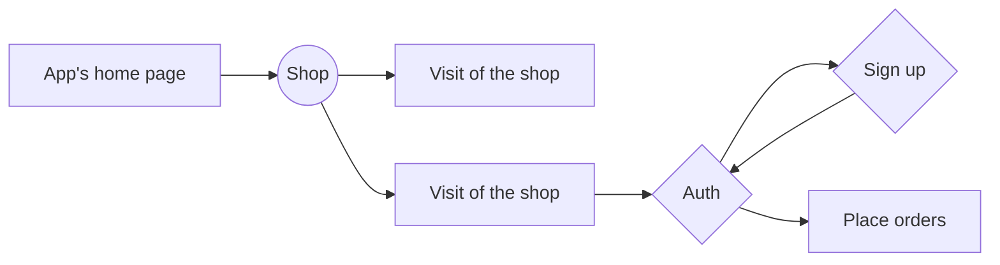
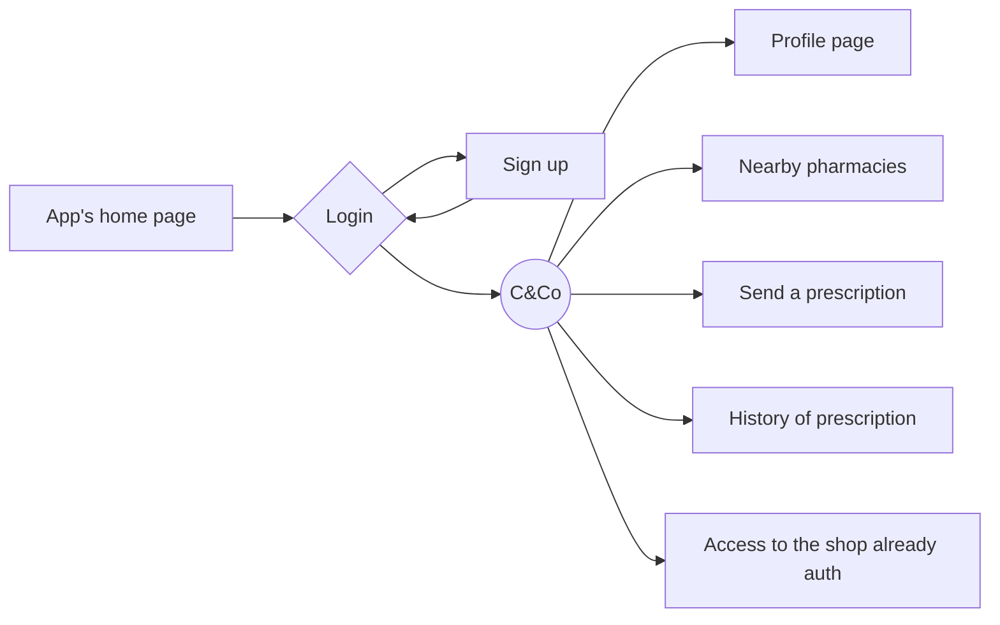
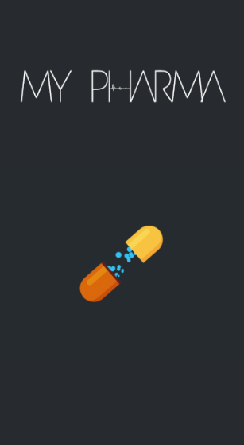
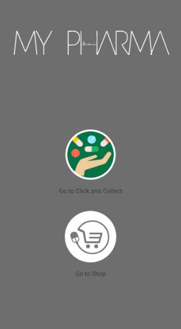
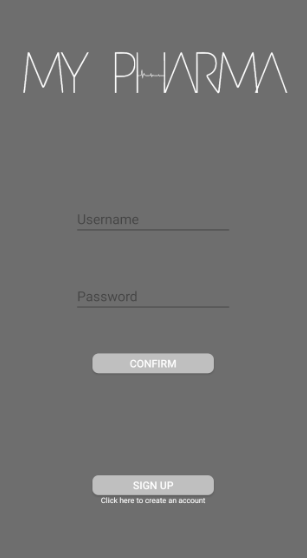
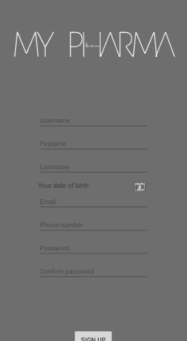
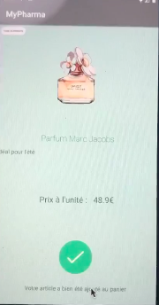
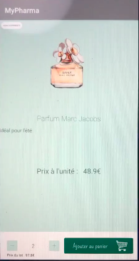
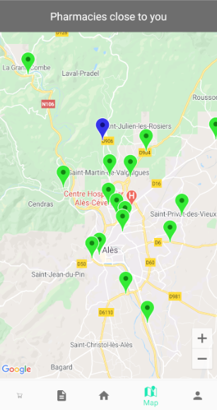
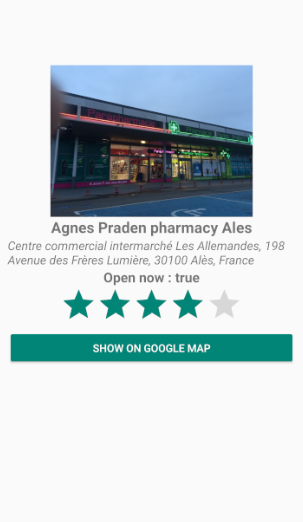

# Pharma-collect mobile app

Pharma collect is a mobile app which allow to send prescription/order to a particular pharmacy and pick out it few moment later into a fully secure box. Pharma collect is by the way cut in two different applications :
- Pharma-collect Client
- Pharma-collect Pro

# Pharma-Collect Client

The client part will allow the user to :
- **Access to a shop**
	- See articles of a pharmacy without being authenticate
	- Get an account and make an order

- **Acces to a private Click&Collect space**
	- Get its informations
	- Send a prescription to a pharmacy
	- Get its localisation and nearby pharamacies
	- Access to the shop
	- Get an historic of prescriptions previously send

## Technologies

The app is made with Kotlin and Java languages.
We work with fragment and mvvm technology (Model-View-ViewModel)

The application is connected to a server (see previous drawing). The application is connected to it by means of an http request (in fact https to obtain more secure transactions). In addition, the application and the most sensitive information are encrypted and cannot be violated.

To be connected with the locker, Pharma-collect will use the QR code technology. It will allow us to verify the identity of the user in front of the box (informations verified by the locker connected to the server).

## The two different parts

### E-Shop

The shop part of the application will allow a user to see the items (**available without prescription**) that are offered in the pharmacy and possibly its promotions and ads.

The visit of the shop is open to anyone who owns the application. However, the order must be made by being logged in and authenticated.

Possibilities of the E-shop:
- Visit of the shop
- Connection
- Add items to the basket
- Placing an order
- Payment

An e-shop is also set up on the web to allow users to access the shop of their favourite pharmacies on any platform. It's based on the same operation.

### Click&Collect

The click & Collect part will allow the user to get a private space totally safe with all its information. This part will not be able on other platform!

Furthermore, the user can do lot of actions on this side of the app, such as :
- Create its account
- Get its informations
- Get the position of all nearby pharmacies
- Send a prescription to the pharmacy he wants
- Get an home page which sums up and concentrate all important informations
- Get a direct access to the shop without being disconnected

The location is set thanks to google maps API localisation and google maps API nearby places

## State of progress

Lets refer to the project board to get more precision

### Common parts

Done :
- Animation page / Splash
- Choice menu
- SignUp
- Login

The common part is ended even if some design modification have to be done

Extract of the app's common parts :

### E-Shop

Done :
- Recup / Display of products
- Products description
- Save items in the shopping cart
- Access to the shopping cart
- Menu/navbar working

### Click&Collect

Done :

- Nearby places
- Nearby pharmacies detail (possibility to show on maps)
- Menu/navbar working

